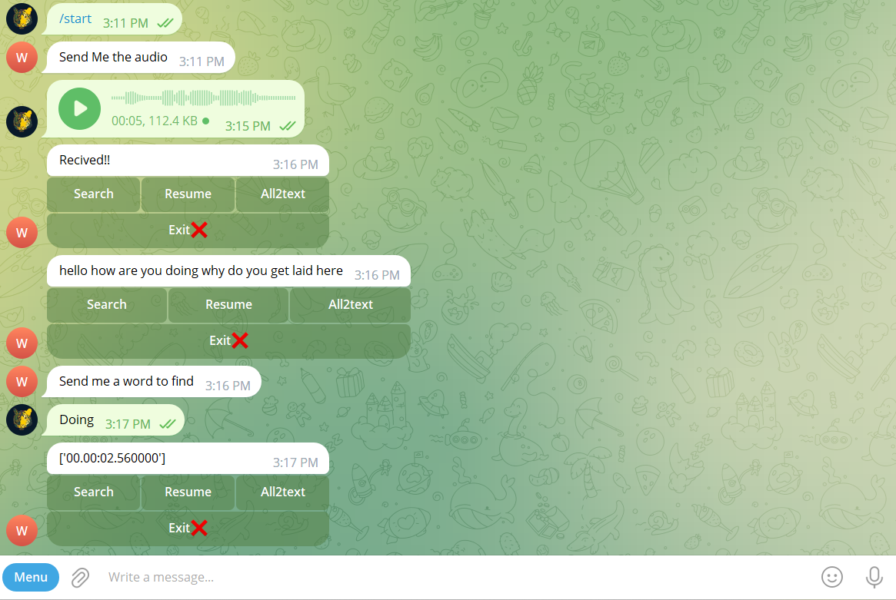

# search_your_voice
# Telegram Audio-to-Text Bot

This repository contains a Telegram bot that allows users to send an audio file and get the transcription in text format. The bot also has the functionality to search for specific phrases within the audio and return the time stamps where they occur.

## Installation

To use this bot, you need to have Python 3 installed on your system. Clone this repository and install the required dependencies using the following command:

pip install -r requirements.txt

Create a new bot on Telegram by talking to the BotFather and obtain the access token. Replace the `TOKEN` variable in the code with your access token.

## Usage

Run the bot using the following command:

python bot.py

Start a conversation with the bot on Telegram and send an audio file. The bot will respond with a message confirming receipt of the audio file.

Use the inline keyboard options to search for specific phrases, get a resume of the audio or convert it to text.

